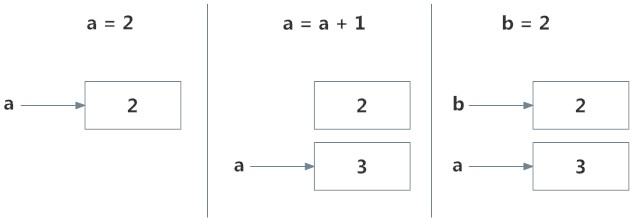

# Learn Python Programming [https://www.programiz.com/python-programming](https://www.programiz.com/python-programming)

Copyright
* Parewa Labs Pvt. Ltd.

ネパールにあるソフトウェア会社

# どんなもの？
とにかくPythonのコードを書いて実行するチュートリアルサイト（英語）

# 先行研究と比べてどこがすごい？
Pythonをほとんど書いたことが無い人でもすらすらとPythonの言語仕様を学べる。

# 技術や手法の肝は？
文法がシンプル、インデントでまとまりを指定するオフサイドルール、で誰が書いても似たようなコードになるため読みやすい。
機械学習で使用できるライブラリが豊富。（TensorFlow, Theano, Chainer, Pytorch, ...）

以下は主にCとの違いと気になった言語仕様をまとめます。

## 動的型付け言語
勝手に適切な型を決めてくれる。
便利な反面メモリの状態がわからなかったり、意図しない型になることもある。

## for文 
* for 変数 in データの集まり:
例 : for char in 'Hello World'

* for 変数 in 繰り返し回数:
例 : for i in range(1, 11):

## 変数の初期代入
Python : a, b, c = 5, 3.2, "Hello"
C      : a = 5, b = 3.2, c = "Hello'

## tuple
listの定数版のようなもの。(キーとして使える)
numbers = (1, 2, 3)

要素を追加したい時は新しいtupleに連結する方法や、一度listにして追加してからtupleに戻す方法など。

## 便利な演算子
// : 商
** : べき乗

数学関数のライブラリを読み込まずに計算できる。（感動）

## メモリの使い方

上記画像のように過去に保存された値を使いまわすことで、メモリの使用量を減らしている。

## 変数に関数を代入する
def printHello():
    print("Hello")
a = printHello()

# Output: Hello
a

print関数を変数aに代入して使うことができる。

## 

# どうやって有効だと検証した？
スレーター行列式を使ったSlater-Jastrow net と比較している。

行列式が一つだけで十分精度が出るという成果も出ている。

# 議論はある？
反対称な関数をニューラルネットで近似する方法を示せた。ニューラルネットの表現力がこの手の計算に役立ちそう。
## 疑問
論文にある分子などは小さいものが多いけど、この手のシミュレーションはどれくらいの大きさの分子まで扱うの？
グラフ系ネットワークで去年読んだ、deepmindのgraph_netsの原論文では、頂点のグルーピングみたいなことは扱っていなくて、今回スピンでグルーピングしていて、予想が的中した感じがする。

# 次に読むべき論文は？
画像処理の入門書やサイトでおすすめのものがあれば教えて欲しいです。（畳み込みしてみたい）

早く皆さんと一緒に研究をしたいので、メンターになってくれる人やちょっとした質問に答えてくれる人を募集しています。
